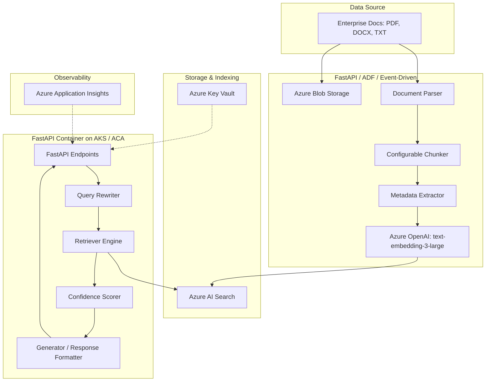

# Enterprise RAG Assistant: Production Architecture

## Production Architecture Diagram

---

## Technical Decision Making & Questions

### 1. Why Azure AI Search?
Azure AI Search provides enterprise-grade scalability, native vector storage, hybrid search pipelines, and seamless integration with other Microsoft Azure ecosystems (e.g., Azure Blob Storage indexers, Entra ID). It manages indexing pipeline tasks, handles low-latency queries, and simplifies indexing vectors and structured metadata fields (like effective dates and arrays of access groups) in a unified resource.

### 2. Why Hybrid Search?
Vector search excels at capturing semantic meaning and conceptual mappings, but can miss exact matching keywords, acronyms, or specific ID codes (e.g., "Article 10"). Hybrid search combines keyword search (BM25) with vector search (cosine similarity) to ensure the best retrieval quality across different query styles.

### 3. Why Semantic Ranking?
While hybrid search merges vector and keyword scores via Reciprocal Rank Fusion (RRF), it does not evaluate the deep contextual alignment of the query with the exact retrieved text. Semantic Reranking (powered by Azure AI Search's integration of Bing reranking models) re-scores the top-K candidates to ensure the most relevant chunks are placed at the top of the context block, reducing distraction and improving LLM answer accuracy.

### 4. How would this scale from 10,000 to 5 million documents?
To scale to millions of documents:
- **Asynchronous Ingestion**: Move ingestion from FastAPI to an event-driven framework using Azure Functions, Event Grid, and Azure Data Factory (ADF).
- **Partitioning & Scaling Units**: Scale Azure AI Search replicas (for query throughput) and partitions (for index sizing). Switch embedding model calls to batch APIs or provisioned throughput (PTU) to prevent rate limits.
- **Incremental Indexing**: Implement blob storage change-tracking and indexers to parse and index only added, updated, or deleted files.

### 5. How would access-controlled RAG work?
For enterprise production:
- Integrate **Microsoft Entra ID** authentication on the FastAPI backend.
- Retrieve the user's group membership claims from their JWT token (claims like `groups`).
- Inject these group claims as an OData filter in the Azure AI Search query (e.g., `access_groups/any(g: search.in(g, 'group_id1, group_id2'))`). This guarantees that unauthorized chunks are filtered out at the retrieval step, before they reach the LLM context.

### 6. How would you optimize cost?
- **Caching**: Implement a semantic cache (e.g., Redis) to cache query-response pairs for identical or highly similar questions, bypassing LLM calls.
- **Top-K Optimization**: Make Top-K dynamic. If the first 2 chunks provide high confidence, avoid sending 5 chunks to save on input token costs.
- **Model Selection**: Use smaller models (e.g., GPT-3.5 or GPT-4o-mini) for simple tasks like query rewriting, reserving GPT-4o for complex grounded answering.

### 7. How would you debug latency?
- Use **Application Insights** to trace a single request ID across all pipeline components.
- Measure latency at each boundary: Query rewriting -> Search API call -> Embedding generator -> LLM call.
- Identify bottlenecks (typically the LLM generation step) and optimize using streaming responses or PTU.
